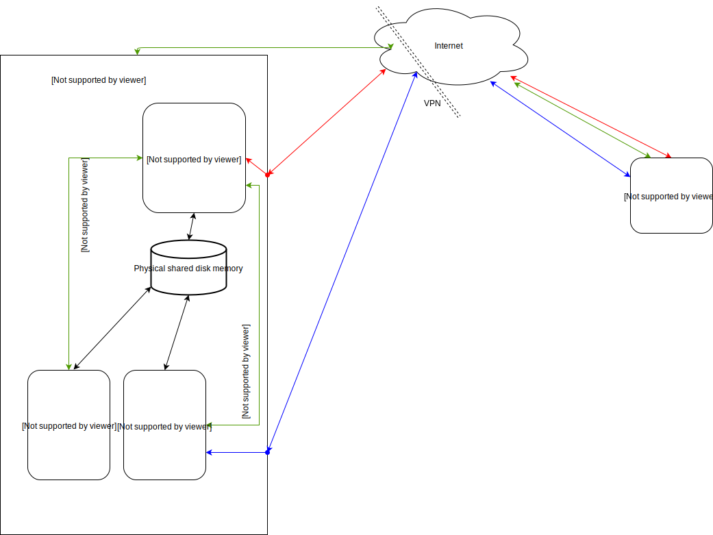

# Nomachine ubuntu server

Run nomachine server to allow **fast** access to 
X on a computer.  This is a lot faster than 
rdp.  It requires a nomachine client, which
exists for all platforms.  In particular, there
is a wonderful version for chrome os.



## Getting started
Copy all files

### Installing
Create the docker image with 
```
make
```

To start the docker container,
```
bash run.sh
```

To start the nomachine server, run 
```
./nxserver.sh &
```

Once the nomachine server starts, log in from some computer with nomachine
to activate the xserver (FIXME).

We now want to turn on x11vnc server so we can vnc into the existing 
x11 display.  First, find the display ID number by 
```
ps aux | grep xfce4-session
```
Take that number (like 143), and
```
cat /proc/143/environ | tr '\0' '\n' | grep DISPLAY
```
to find the display ID number.

Then, activate x11vnc with 
```
x11vnc -nap -wait 50 -noxdamage -display :1001 -forever -rfbport 5980 &
```
where 5980 is the port to connect onto locally.  This must be done as the
user that logged into the nomachine (david)

To connect locally, 
```
vncviewer 172.17.0.6::5980
```
where `172.17.0.6` is the IP address of the nomachine docker image

### Customizing
You will need to edit run.sh in your favorite text editor.

#### GUI settings
To ensure your desktop has the same desktop settings, including
the correct preferances for okular, select
a location for the home directory
```
-v /path/to/home/directory:/home \
```

#### Add Library
```
-v /path/to/library:/library
```

## Accessing through a DNS server
I run with a dns server with iptables.  Here is the rule I use
to let nomachine through:

```
iptables -t nat -A PREROUTING -i enp0s0 -d <IP address of DNS server> -p tcp --dport 4000 -j DNAT --to-destination <IP address of docker host>:4000
iptables -A FORWARD -p tcp -d <IP address of docker host> --dport 4000 -m state --state NEW,ESTABLISHED,RELATED -j ACCEPT
```
